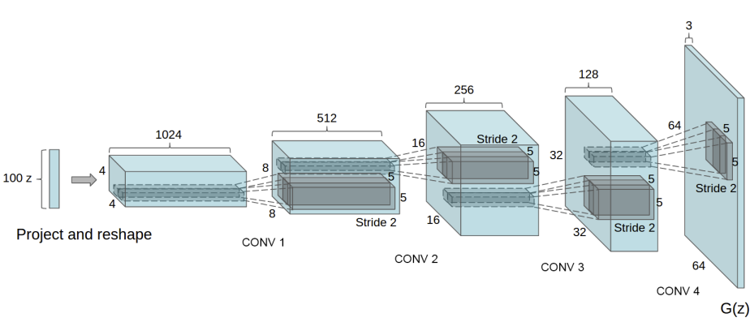

# Deep Convolutional Generative Adversarial Networks

See [**Jupyer notebook**](https://nbviewer.jupyter.org/github/jscriptcoder/DCGANs/blob/master/face_generation.ipynb) for details about this project, hyperparameters and algorithms used.

This project is based on the paper: [Unsupervised Representation Learning with Deep Convolutional Generative Adversarial Networks](https://arxiv.org/abs/1511.06434), and part of [Udacity Deep Learning Nanodegree program](https://www.udacity.com/course/deep-learning-nanodegree--nd101)

The goal of this project is to get a generator network to creaate new images of faces that look as realistic as possible!

Examples:
<p align="center">
  <br />
  <br />
</p>

## What is a DCGAN?
A DCGAN is an extension of Generative Adversarial Network that uses convolutional and convolutional-transpose layers in the discriminator and generator, respectively. As described in the [paper](https://arxiv.org/pdf/1511.06434.pdf), the **discriminator** is made up of strided [convolutional layers](https://cs231n.github.io/convolutional-networks/#conv), [batch norm layers](https://arxiv.org/abs/1502.03167), and [LeakyReLU activations](https://ml-cheatsheet.readthedocs.io/en/latest/activation_functions.html#leakyrelu). The input is an image and the output is a scalar probability that the input is from the real data distribution. The **generator** is comprised of [convolutional-transpose layers](https://medium.com/activating-robotic-minds/up-sampling-with-transposed-convolution-9ae4f2df52d0), batch norm layers, and [ReLU activations](https://ml-cheatsheet.readthedocs.io/en/latest/activation_functions.html#relu). The input is a [latent vector](https://towardsdatascience.com/understanding-latent-space-in-machine-learning-de5a7c687d8d), `z`, that is drawn from a standard normal distribution and the output is an image, same size as the input of the discriminator.



Above we can see what a **DCGAN Generator** looks like. A 100 dimensional uniform distribution <b>Z</b> is projected to a small spatial extent convolutional representation with many feature maps. A series of four fractionally-strided convolutions (in some recent papers, these are wrongly called deconvolutions) then convert this high level representation into a 64 × 64 pixel image. Notably, no fully connected or pooling layers are used.

### Architecture guidelines for stable Deep Convolutional GANs

- Replace any pooling layers with strided convolutions (discriminator) and fractional-strided convolutions (generator).
- Use batchnorm in both the generator and the discriminator.
- Remove fully connected hidden layers for deeper architectures.
- Use ReLU activation in generator for all layers except for the output, which uses Tanh.
- Use LeakyReLU activation in the discriminator for all layers.

### Discriminator Implementation

```python
class Discriminator(nn.Module):

    def __init__(self, conv_dim):
        """
        Initialize the Discriminator Module
        Args:
            conv_dim (int): The depth of the first convolutional layer
        """
        super(Discriminator, self).__init__()

        self.conv_dim = conv_dim
        
        # 3x64x64
        self.conv1 = conv(in_channels=3, 
                          out_channels=conv_dim, 
                          kernel_size=4, 
                          batch_norm=False)
        # 32x32x32
        self.conv2 = conv(in_channels=conv_dim, 
                          out_channels=conv_dim*2, 
                          kernel_size=4)
        # (32x2)x16x16
        self.conv3 = conv(in_channels=conv_dim*2, 
                          out_channels=conv_dim*4, 
                          kernel_size=4)
        # (32x4)x8x8
        self.conv4 = conv(in_channels=conv_dim*4, 
                          out_channels=conv_dim*8, 
                          kernel_size=4)
        # (32x8)x4x4
        self.fc = nn.Linear(conv_dim*8*4*4, 1) # -> output: 1
        
        self.leaky_relu = nn.LeakyReLU(0.2)
        
    def forward(self, x):
        """
        Forward propagation of the neural network
        
        Args:
            x (Tensor): The input to the neural network     
        
        Return:
            Discriminator logits; the output of the neural network
        """
        
        x = self.leaky_relu(self.conv1(x))
        x = self.leaky_relu(self.conv2(x))
        x = self.leaky_relu(self.conv3(x))
        x = self.leaky_relu(self.conv4(x))
        
        # flatten
        x = x.view(-1, self.conv_dim*8*4*4)
        
        x = self.fc(x)
        
        return x
```

### Generator Implementation

```python
class Generator(nn.Module):
    
    def __init__(self, z_size, conv_dim):
        """
        Initialize the Generator Module
        
        Args:
            z_size (int): The length of the input latent vector, z
            conv_dim (int): 
                The depth of the inputs to the *last* transpose convolutional layer
        """
        super(Generator, self).__init__()
        
        self.conv_dim = conv_dim
        
        # 100
        self.fc = nn.Linear(z_size, conv_dim*8*4*4)
        # (32x8)x4x4
        self.deconv1 = deconv(in_channels=conv_dim*8, 
                              out_channels=conv_dim*4, 
                              kernel_size=4)
        # (32x4)x8x8
        self.deconv2 = deconv(in_channels=conv_dim*4, 
                              out_channels=conv_dim*2, 
                              kernel_size=4)
        # (32x2)x16x16
        self.deconv3 = deconv(in_channels=conv_dim*2, 
                              out_channels=conv_dim, 
                              kernel_size=4)
        # 32x32x32
        self.deconv4 = deconv(in_channels=conv_dim, 
                              out_channels=3, 
                              kernel_size=4, 
                              batch_norm=False) # -> output: 3x64x64
        
        self.relu = nn.ReLU()
        self.tanh = nn.Tanh()
        
    def forward(self, x):
        """
        Forward propagation of the neural network
        
        Args:
            x (Tensor): The input to the neural network
        
        Return:
            A 3x64x64 Tensor image as output
        """
        
        x = self.fc(x)
        
        # reshape
        x = x.view(-1, self.conv_dim*8, 4, 4) # (batch_size, channels, 4, 4)
        
        x = self.relu(self.deconv1(x))
        x = self.relu(self.deconv2(x))
        x = self.relu(self.deconv3(x))
        x = self.tanh(self.deconv4(x))
        
        return x
```

## Details of Adversarial Training

- Scaling images to the range of the tanh activation function [-1, 1].
- All weights are initialized from a zero-centered Normal distribution with standard deviation 0.02.
- In the LeakyReLU, the slope of the leak is set to 0.2.
- Adam optimizer with learning rate of 0.0002 and β1 is set to 0.5.
